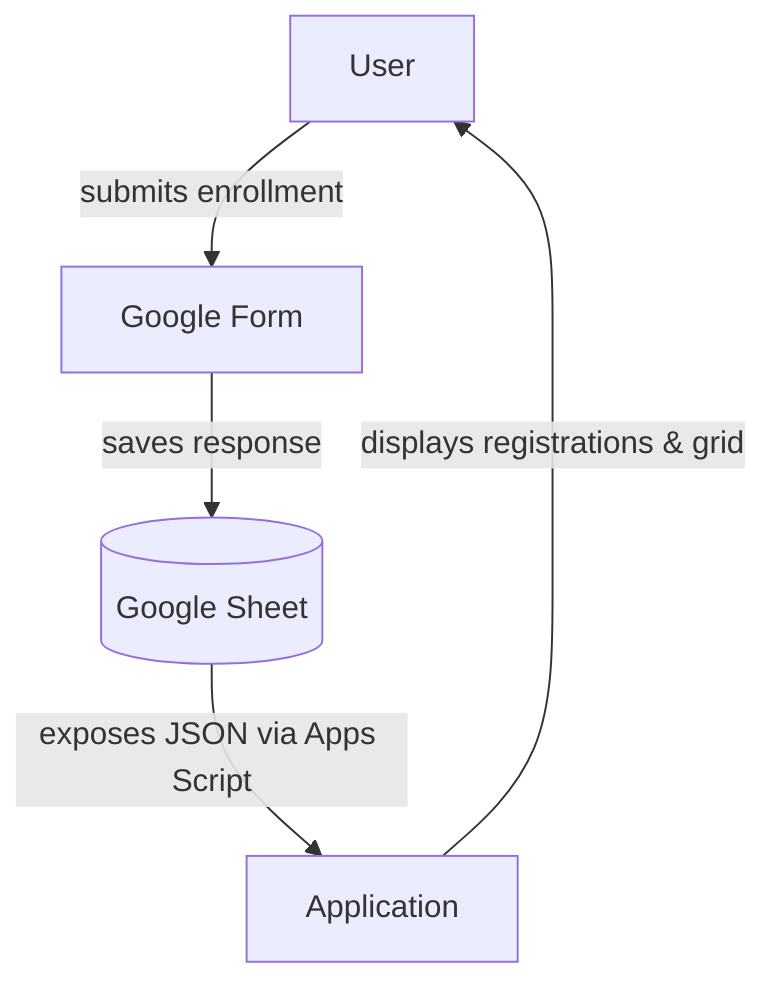

# Gladiator Gokart Games https://gladiatorgokartgames.pl/

## **Roadmap**

- [] Tests in workflow
- [] Local workflow usign devcontainers
- [] Documentation of configuring race from, sheet, download resultsd from email, parsing race results 
- [] Configure forms and pages (with sheets and for permission till to the end of season)
- [] Calculating total classification
- [] Filling past seasones
- [] Drivers profiles
- [] Add nicknames mapping

## **Application Flow**



## **Configuration**

### Google form

Setup with one text field and google sheet as output

### Google sheet

Expose as JSON for application: extensions -> Apps Scrips -> deploy trigger -> as Application to everyone -> add permissions
```js
function doGet() {
    const sheet = SpreadsheetApp.getActiveSpreadsheet().getActiveSheet()
    const [header, ...rows] = sheet.getDataRange().getValues()
    const data = rows.map(row =>
      Object.fromEntries(header.map((h, i) => [h, row[i]]))
    )
    return ContentService.createTextOutput(JSON.stringify(data)).setMimeType(ContentService.MimeType.JSON)
  }
```
